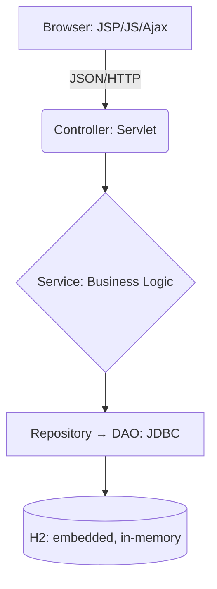

# 🔐 Auth on Raw Servlets — Login & Register

> A learning-focused backend that implements **user registration and login** from scratch on
> raw Jakarta Servlets (no Spring), with a vanilla JS + JSP/Ajax frontend. The goal is to master
> the HTTP request/response lifecycle, JDBC, sessions, and filter chains by hand.

---

## 🎯 Project Vision
Master the **Request-Response lifecycle** at its lowest level — no framework "magic." This project
implements exactly two flows, end to end: **register** and **login**.

* **Low-level mastery:** Handling HTTP, Sessions, filter chains, and JDBC manually.
* **Professionalism:** Clean code, rigorous documentation, and security-first thinking.

> **Scope:** the only implemented endpoints are **`POST /auth/register`** and **`POST /auth/login`**.
> Nothing else is built.

---

## 🛠 Technology Stack

| Layer | Technology |
| :--- | :--- |
| **Frontend** | Vanilla JS + JSP/JSTL, **Ajax (Fetch API)** |
| **Backend** | **Java 21**, Jakarta Servlet 6.0.0 (no Spring), raw JDBC |
| **Database** | **H2 2.2.224** — embedded, in-memory (MODE=MySQL), pooled with **HikariCP 5.1.0** |
| **Libraries** | Gson 2.8.9 (JSON), jbcrypt 0.4 (BCrypt), SLF4J 2.0.12 + Logback 1.5.13 |
| **Build & Run** | Maven (WAR → `target/docker-servlet.war`), **Tomcat 10** (`tomcat:10-jdk21`), Docker Compose on **colima**, orchestrated via a `Makefile` |

---

## 🏗 System Architecture
The project follows a strict **Layered Architecture** to keep concerns separated. Every request
also flows through a manually-ordered **filter chain** (exception handling → request tracing → CORS
→ security headers → auth → transaction) declared in `web.xml`.



### Layer Responsibilities
* **Controller (Servlet):** Orchestrates HTTP requests, parses JSON, and routes to services.
* **Service Layer:** The "Brain." Handles validation and business rules.
* **Repository → DAO:** The "Hands." Executes `PreparedStatement` SQL and maps ResultSets to Java objects, using the request-scoped transactional connection.

---

## 🧠 Implemented Features

### 👤 User Registration — `POST /auth/register`
* **Async form** with real-time validation via Ajax (Fetch API).
* **Security:** Password hashing using **BCrypt** (no plain text ever stored).
* Persists to `users` + `profiles` in a single request-scoped transaction.

### 🔑 Login & Session — `POST /auth/login`
* Verifies credentials against the BCrypt hash.
* Establishes a role-based **`HttpSession`** (`Customer` / `Admin`).

> These are the only two endpoints served.

---

## 🔐 Security Standards
> "Security is not an afterthought; it is a requirement."

1.  **SQL Injection:** Strictly using `PreparedStatement` for all queries.
2.  **Sensitive Data:** Passwords salted and hashed with BCrypt before hitting the database.

---

## 🚀 Build & Run

The `Makefile` at the repo root is the canonical entry point (`make help` lists all targets). H2 is embedded — there is no separate database container.

```bash
# Build the WAR only (output: target/docker-servlet.war)
mvn clean package

# Full local stack: build + start colima + docker compose up
make dev

# Rebuild the WAR and restart Tomcat to pick it up
make redeploy

# Stop the containers
make down
```

The app runs at context root `/` on http://localhost:8080. All data is in-memory and wiped on every restart; the schema is re-created on startup by `SchemaInitListener`.

---

## 📂 Project Structure
```text
/ecommerce-ajax-servlet
├── /docs                    # Deep-dive documentation (Requirements, API, DB, Architecture)
├── /src/main/java           # Java Backend
│   └── /org/phuchoang2005/ecommerce
│       ├── /controller      # Servlets (endpoints)
│       ├── /service         # Business logic
│       ├── /repository      # Data access seam
│       ├── /dao             # Raw JDBC
│       ├── /dto             # Data Transfer Objects (JSON contract)
│       ├── /filter          # Filter chain (exception, tracing, CORS, security, auth, transaction)
│       ├── /listener        # SchemaInitListener (startup schema)
│       ├── /util            # DB context, sessions, password, logging helpers
│       └── /exception       # BaseException hierarchy
├── /src/main/webapp         # Frontend (JSPs + JS)
├── /src/main/resources      # schema.sql, logback.xml
├── /docker                  # docker-compose + helper scripts
├── /logs                    # Application logs
├── Makefile                 # Build/run entry point
└── pom.xml                  # Maven dependencies
```

---

## 📖 Documentation Guide
To explore this project properly, follow this path:

1.  **The "Why":** `/docs/business-logic/` — auth requirements (login, register).
2.  **The "Data":** `/docs/database/` — the ERD and schema for `users` / `profiles`.
3.  **The "How":** `/docs/architecture/` — sequence diagrams for the login and register flows.
4.  **The "Contract":** `/docs/api/` — OpenAPI specs for `/auth/login` and `/auth/register`.

---

### 👨‍💻 Author
**Phuc Hoang**
*Focus: Java Fullstack Developer Intern Preparation*
*Motto: "Build it from scratch to understand why the tools exist."*
