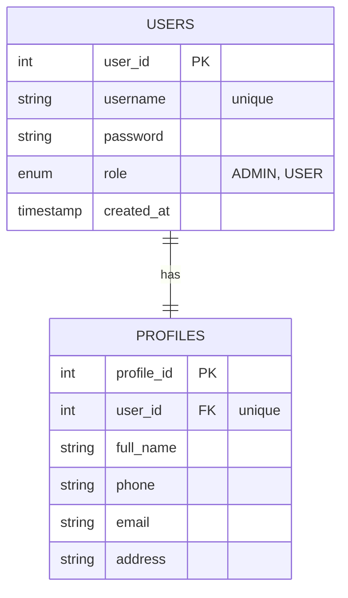

# DATABASE DESIGN

> **Scope.** This document covers only the tables used by the currently implemented
> features — **registration and login**. The startup schema (`src/main/resources/db/schema.sql`)
> also creates scaffolding tables (`categories`, `products`, `orders`, `order_details`) for
> future phases (catalog, cart, checkout), but no application code touches them yet, so they
> are intentionally left undocumented here.

## 1. Entity Relationship Diagram (ERD)

The two tables backing authentication and the 1:1 relationship between them:

---

## 2. Data Dictionary

### 2.1 Table: `users` (Account & Authorization)
This table acts as the "Source of Truth" for authentication. Using an `INT` as the Primary Key (PK) instead of a `username` optimizes indexing performance and aligns with the `userId` specification in the API design.

| Column | Data Type | Constraints | Description |
| :--- | :--- | :--- | :--- |
| **user_id** | INT | **PK**, AUTO_INCREMENT | Unique identifier for each user. |
| **username** | VARCHAR(50) | UNIQUE, NOT NULL | Login credential. |
| **password** | VARCHAR(255) | NOT NULL | Hashed password (BCrypt via jbcrypt). |
| **role** | ENUM('ADMIN','USER') | DEFAULT 'USER' | System access level. |
| **created_at** | TIMESTAMP | DEFAULT CURRENT_TIMESTAMP | Account registration timestamp. |

### 2.2 Table: `profiles` (User Information)
Separating login credentials from personal information increases system flexibility (e.g., a user can update their contact info without affecting auth logic). Written once during registration by `ProfilesDAO.insertProfile`.

| Column | Data Type | Constraints | Description |
| :--- | :--- | :--- | :--- |
| **profile_id** | INT | **PK**, AUTO_INCREMENT | Unique identifier for the profile. |
| **user_id** | INT | **FK**, UNIQUE | 1:1 relationship with the `users` table. |
| **full_name** | VARCHAR(100) | NOT NULL | User's full name for UI display. |
| **phone** | VARCHAR(20) | | Contact phone number. |
| **email** | VARCHAR(100) | | Email for order notifications. |
| **address** | VARCHAR(255) | | Default shipping address. |

---

## 3. Referential Integrity & Business Logic

### 3.1 Integrity Rules
* **ON DELETE CASCADE (`profiles`):** When a user is deleted, the associated profile is automatically removed to prevent "orphaned" data.

### 3.2 Role-Based Access Control (RBAC)
The `role` column in the `users` table is carried through login into the session and is intended to drive authorization once protected routes exist:
* **ADMIN:** elevated access level.
* **USER:** standard customer access level (default).

> Note: role-based authorization is not yet enforced anywhere in the current code — the `role`
> value is stored and returned in `LoginResponseDTO`, but no route gates on it today.

---

## 4. Key Design Advantages

1.  **Standardized Conventions:** Using English table and column names facilitates better compatibility with modern Frontend frameworks and data-mapping libraries.
2.  **API Compatibility:** The schema maps cleanly to the OpenAPI specification — e.g. `user_id` maps to `userId` in the DTO/JSON contract.
3.  **Separation of Concerns:** Splitting credentials (`users`) from personal data (`profiles`) keeps auth logic isolated and makes future profile-management features straightforward to add.
